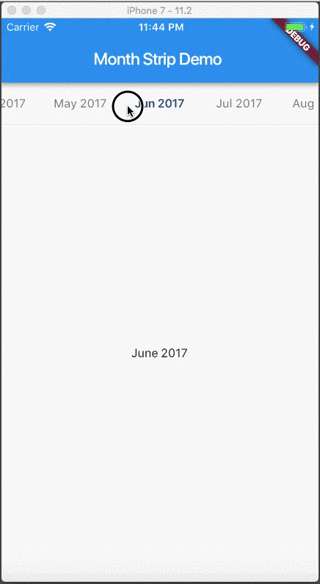

# Month Picker Strip
Widget is a slider that helps to pick month.



# Usage
Let's demo the basic usage
```dart
import 'package:flutter/material.dart';
import 'package:intl/intl.dart';
import 'package:month_picker_strip/month_picker_strip.dart';

void main() => runApp(new MyApp());

class MyApp extends StatelessWidget {
  @override
  Widget build(BuildContext context) {
    const title = 'Month Strip Demo';
    return new MaterialApp(
      title: title,
      theme: new ThemeData(
        primarySwatch: Colors.blue,
      ),
      home: new MyHomePage(title: title),
    );
  }
}

class MyHomePage extends StatefulWidget {
  MyHomePage({Key key, this.title}) : super(key: key);

  final String title;

  @override
  _MyHomePageState createState() => new _MyHomePageState();
}

class _MyHomePageState extends State<MyHomePage> {
  final DateFormat dateFormat = new DateFormat('MMMM yyyy');
  DateTime selectedMonth;

  @override
  void initState() {
    super.initState();
    selectedMonth = new DateTime(2017, 6);
  }

  @override
  Widget build(BuildContext context) {
    return new Scaffold(
      appBar: new AppBar(
        title: new Text(widget.title),
      ),
      body: new SafeArea(
        child: new Column(
          children: <Widget>[
            new Divider(
              height: 1.0,
            ),
            new MonthStrip(
              format: 'MMM yyyy',
              from: new DateTime(2016, 4),
              to: new DateTime(2018, 5),
              initialMonth: selectedMonth,
              height: 48.0,
              viewportFraction: 0.25,
              onMonthChanged: (v) {
                setState(() {
                  selectedMonth = v;
                });
              },
            ),
            new Divider(
              height: 1.0,
            ),
            new Expanded(
              child: new Center(
                child: new Text(dateFormat.format(selectedMonth)),
              ),
            ),
          ],
        ),
      ),
    );
  }
}
```
